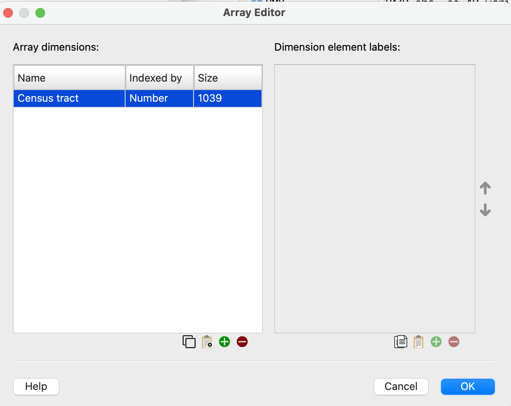
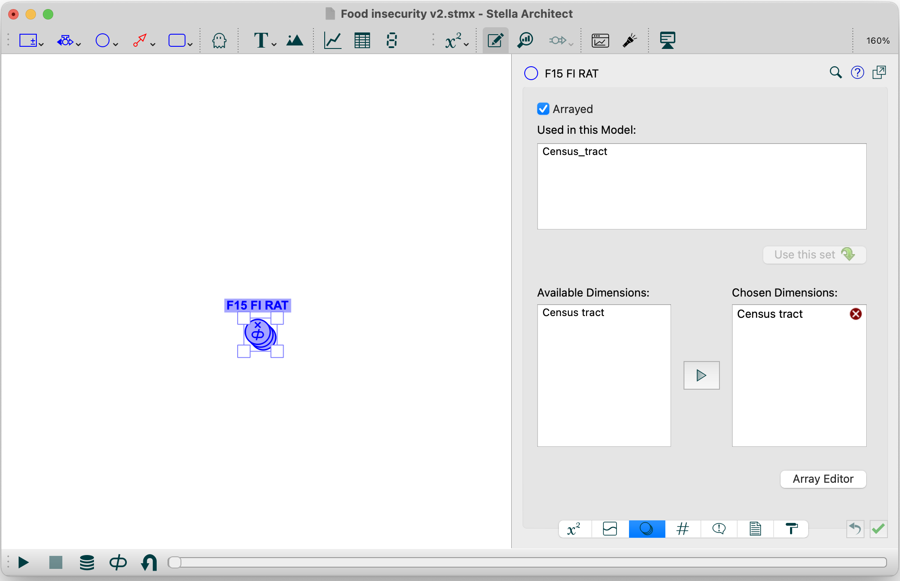
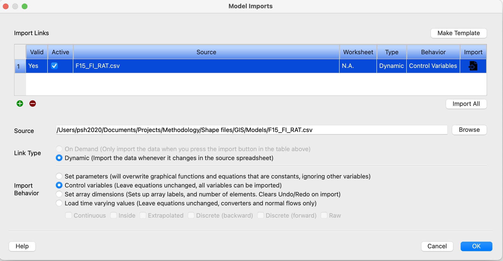
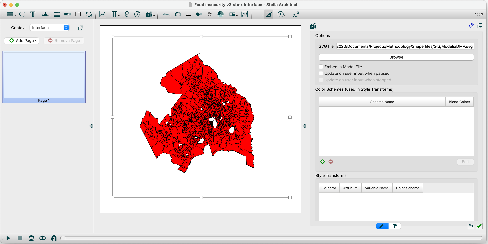

```{r setup, include=FALSE}
knitr::opts_chunk$set(echo = TRUE)
```

# Introduction

Shapefiles are a standard format for representing geographic boundaries and data. For example, data on poverty rates, home ownership rates, lead exposures, and disease incidence and prevalance are often shown as maps based on shapefiles. Common units of geographic representation in shapefiles include census tracts, zip codes, municiple, county, and state boundaries.  

While Stella interfaces don't directly support shapefiles, Stella does support importing and using scalable vector graphics (SVG) files as animations. Doing this would allow one to visualize changes in geographic information in a way that is easy to relate to and convey information about regional variations and inequities. While this can be done by manually converting files, such a process would be cumbersome and error prone when working with larger spatial datasets or when developing a more generalizable approach. Hence, a set of tools are needed for importing shapefiles and exporting them into a format that can be directly used by Stella. 

The goal of this project is to provide a set of tools and examples for automating the task of converting shapefiles into a format that can easily be used in a Stella model and interface. 

# Required packages

This notebook uses several different R packages including `tidyverse`, which provides functionality for piping of commands, filtering, importing and plotting files using ggplot, and exporting ggplot graphics as SVG files.  The `sf` package supplies functions for importing and manipulating spatial objects including functions for importing shapefiles. The `svglite` package provides functions for exporting ggplot graphics as scalable vector graphics files.  

```{r required packages}
library(tidyverse)
library(sf)
require(svglite)
```

# Sample data

The sample data comes from the publicly available Capital Area Food Bank covering the DC, Maryland, and Virginia metropolitan area. In addition to basic demographic information, the shapefile has several variables related to food inscurity for 2014 and 2015.

Variable   | Description
-----------|--------------------------------
15_FI_Rate | The estimated portion of the population in the census tract experiencing food insecurity (by CAFB standards). 15/14 indicates year measured.
15_FI_Pop | The estimated number of people in the census tract experiencing food insecurity (by CAFB standards). 15/14 indicates year measured.
15_LB_Need | The estimated pounds of food needed by the food insecure population in the census tract. 15/14 indicates year measured.
15_Distrib | The number of pounds of food distributed by CAFB and partners in the census tract. 15/14 indicates year in which the distribution took place.
15_LB_Unme | The difference between the estimated pounds of food needed and the real pounds of food distributed by CAFB and partners, representing the unmet need for food assistance in the census tract. 15/14 indicates year.

# Importing, plotting, and exporting shapefile basics

Shapefiles are commonly available as files with a .shp extension. The `st_read` function from the `sf` package is used to import shape files.

```{r read shapefiles}
# Import DC, Maryland, and Virginia region shape files
DMV <- st_read("Data/Capital_Area_Food_Bank_Hunger_Estimates.shp")
```

```{r test plotting}
# Plot shape file
ggplot(data = DMV) +
  geom_sf()
```

# Approach


1. In RStudio, import the shapefile data, generate a ggplot figure, and export this into a SVG file.
2. In RStudio, export the data for the variable of interest to a .csv file that can imported by Stella to initialize an array.  
3. In Stella, create a model and define the variable as an array with one element for each geographic area.
4.  

## Importing the shapefile and exporting SVG file


```{r Improting the shapefile}
DMV <- st_read("Data/Capital_Area_Food_Bank_Hunger_Estimates.shp")
```


```{r Plotting shape file}
# Plot DMV region without grids and other elements
ggplot(data = DMV) +
  geom_sf(fill = "red", color = "black") +
  coord_sf(xlim=c(-77.8,-76.5), ylim=c(38.4,39.4)) +
  theme(
    panel.ontop = TRUE,   ## Note: this is to make the panel grid visible in this example
    panel.grid = element_blank(),
    line = element_blank(),
    rect = element_blank(),
    text = element_blank(),
    plot.background = element_rect(fill = "white"))
```

```{r Exporting plot to SVG file}
ggsave("Models/DMV.svg")
```

## Exporting initial values to a .csv file

The DMV data has a variable `F15_FI_RAT` representing the prevalence of food insecurity, which needs to be exported to a .csv file that can then be imported into a Stella model. Note that the dimension of the array has to equal the length of the variable. 

```{r export initial values to .csv file}
write.csv(list(F15_FI_RAT=DMV$F15_FI_RAT), file = "Models/F15_FI_RAT.csv", row.names=FALSE)
length(DMV$F15_FI_RAT)
```

## Setting up the arrays in Stella

The next step is setting up an arrayed variable in Stella with the same length as the number of rows in the data. First, create the array with the dimensions so they can be assigned when creating the variale.   

{width=50%}

Next, create a variable with the *exact same name* as the variable being imported and dimensions using the array dimensions defined above. Making sure the name is the same is important because this is the only way that Stella will recognize the variable during the import of the data. 

{width=50%}

Finally, set up an import link to the .csv file and test the import to verify the connection. 

{width=50%}

## Setting up the animation object in Stella

Next, we set up the animation object in Stella using the SVG file created earlier, and then save the model. We'll use this version of the Stella model with the .stmx to modify the model so that the elements of the animation object use values from the variable we just created. 

{width=50%}

If we now open the .stmx file in a text editor (e.g., an editor that recognizes xml markup language such as Atom can be helpful here), then we can search the text for the SVG file we used to find animation object just created, which should look something like the following:

````{verbatim, lang="xml"}
<isee:animation_object x="42" y="37" width="565" height="513.445">
  <image>r../DMV.svg</image>
</isee:animation_object>
````

This animation object does not yet have the variable associated with an output attribute. For a few cases, we can set this up manually. If we do this for one variable, save the model, and then reexamine the .stmx file, we should see something like the following, which was added when we associated a variable to an element (or node) in SVG object:

````{verbatim, lang="xml"}
<isee:animation_object x="42" y="37" width="565" height="513.445">
  <image>r../DMV.svg</image>
	<isee:animation_css_transforms>
	  <isee:animation_css_transform attribute="fill-opacity" 
     selector="g:nth-child(9) &gt; path:nth-child(1)" variable="F15_FI_RAT[1]"/>
    </isee:animation_css_transforms>
  </isee:animation_object>
````

In this case, the variable is used to set the fill opacity of the census tract. Fill opacity ranges from a value of 0 to 1. 


